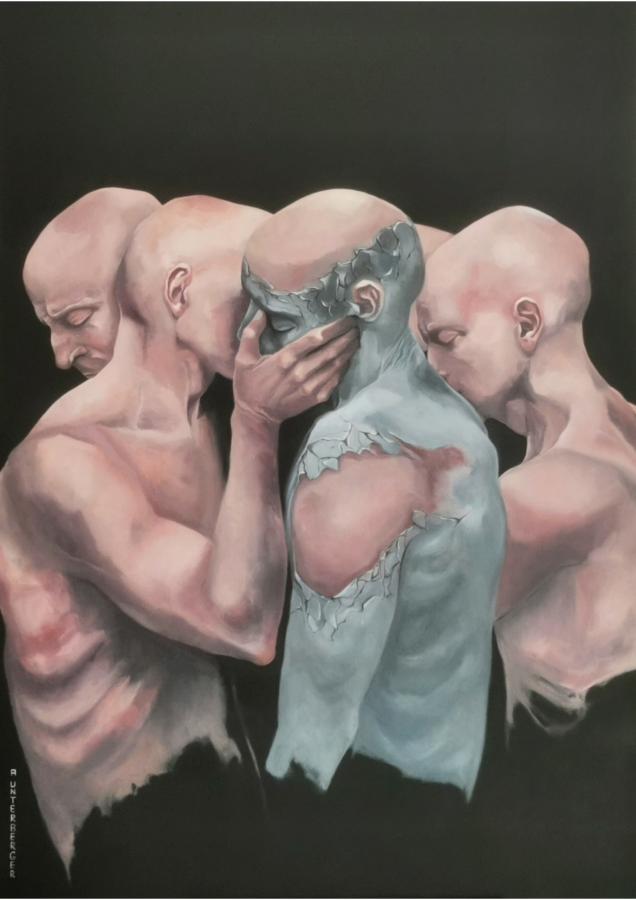

# Existere

**Titel:** Existere  
**Technik:** Öl auf Leinwand  
**Größe:** 140 × 100 × 4,5 cm  
**Jahr:** 2025  
**Preis:** € 4.300

## Bildbeschreibung

Das Werk thematisiert die Idee der Verbundenheit. Mehrere Figuren sind eng miteinander verbunden und symbolisieren den Menschen als soziales Wesen.

Die zentrale Gestalt tritt aus einer schützenden Hülle hervor.

"Existere" - Hervortreten.

Im Vordergrund steht die Aussage, dass weder Geschlecht, Herkunft, noch sozialer Status eine Rolle für das Zusammenleben spielen sollten.

Die Komposition betont das Gemeinsame und verweist auf die Notwendigkeit eines Miteinanders statt Gegeneinanders.
